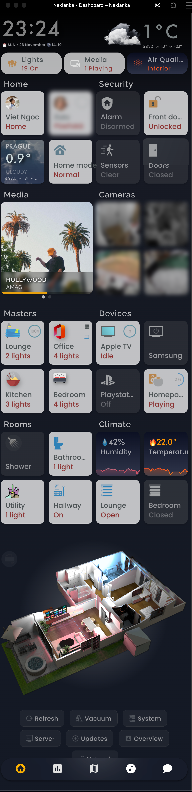
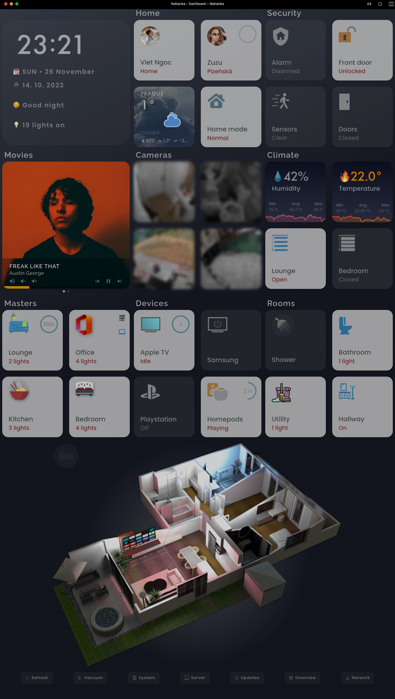
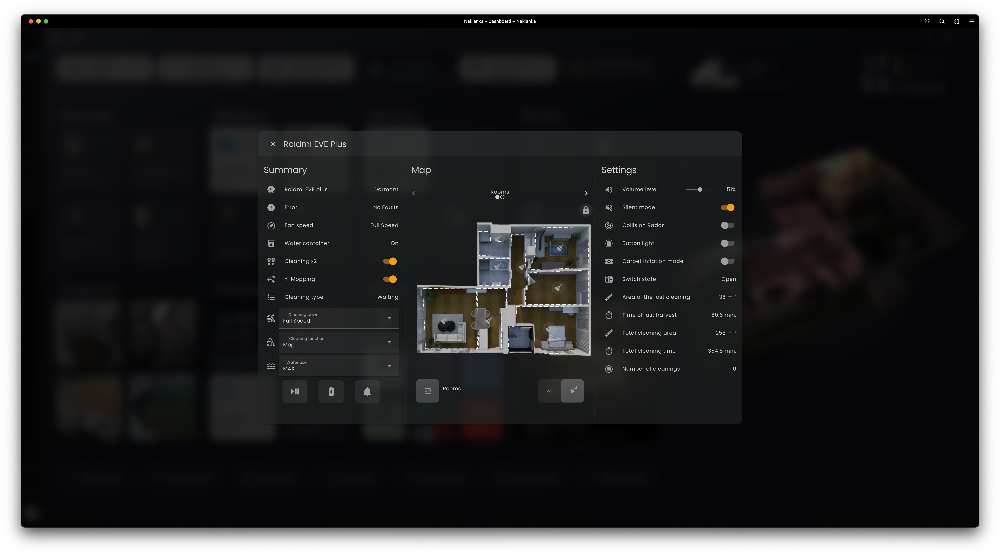
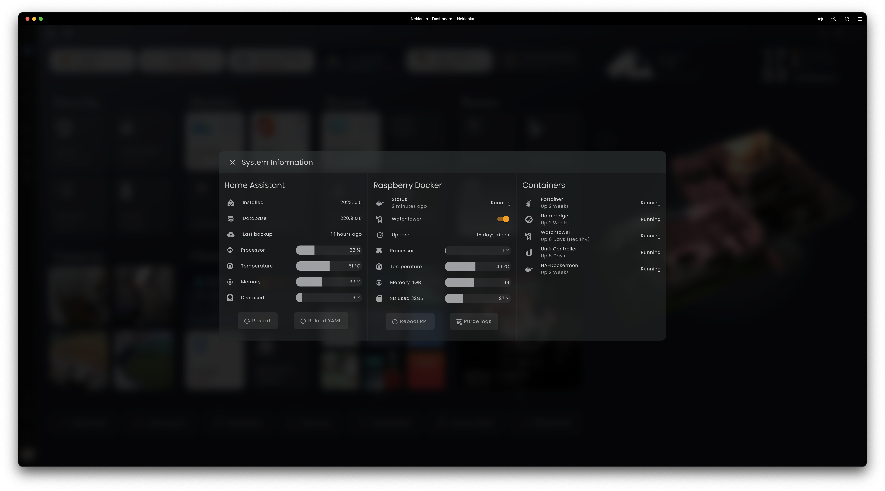
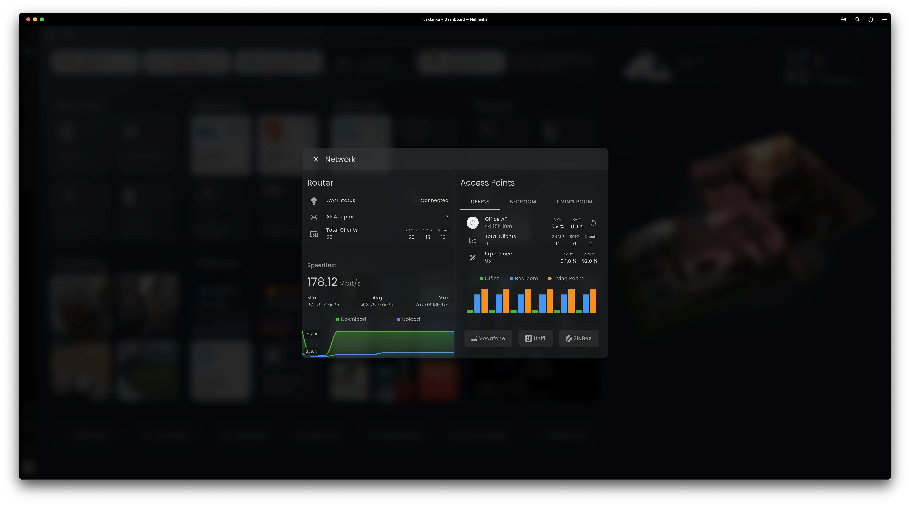
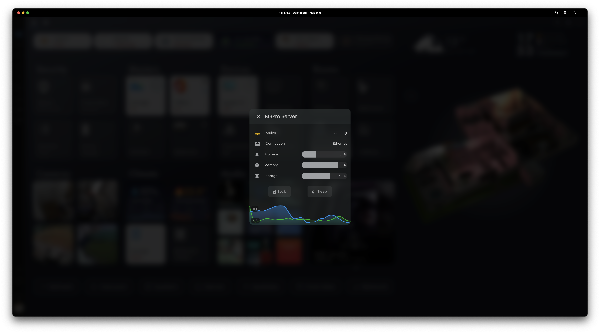

    
    
				

# Home Assistant Configuration

Hey there! Welcome to my little corner of the tech world! 👨‍💻

This is where I store all the cool configurations for my Home Assistant system. Well, it's a mix of awesome codes and setups I discovered from the Home Assistant community. Seriously, those folks are wizards! 🧙‍♂️ As a bit of an internet newbie turned tech enthusiast, I stumbled upon the magic of IT, and this repository is my way of sharing the joy and knowledge I've gained along the way. Dive in, explore, and let the tech magic begin! ✨

I frequently refresh my configuration files. My current Home Assistant version is <b>2025.4.4</b>. If you find something you like, don't forget to give my repository a ⭐️!

## Some of my projects for Home Assistant

<video width="100%" controls loop muted>
  <source src="https://github-production-user-asset-6210df.s3.amazonaws.com/96962827/297112091-acc1a4db-b92e-4ab1-ac9d-df067d4ba4d1.mp4" type="video/mp4">
</video>

https://github.com/ngocjohn/hass-config/assets/96962827/acc1a4db-b92e-4ab1-ac9d-df067d4ba4d1

## Some statistics about my installation

  <table>
      <thead>
          <tr>
              <th>Lines of code</th>
              <th>Automations</th>
              <th>Binary sensors</th>
              <th>Device trackers</th>
              <th>Lights</th>
              <th>Media players</th>
              <th>Sensors</th>
              <th>Switches</th>
              <th>Scripts</th>
          </tr>
      </thead>
      <tbody>
          <tr>
              <td>37,254 </td>
              <td>31</td>
              <td>156</td>
              <td>63</td>
              <td>51</td>
              <td>33</td>
              <td>1154</td>
              <td>221</td>
              <td>28</td>
          </tr>
      </tbody>
  </table>

## My installed extensions

  
Add-ons

### Add-ons
- Advanced SSH & Web Terminal
- ArgonOne Active Linear Cooling
- Cloudflared
- DbStats
- eufy-security-ws
- Glances
- MariaDB
- Mosquitto broker
- Music Assistant Server
- Node-RED
- phpMyAdmin
- PS5 MQTT
- Samba share
- Studio Code Server
- Xiaomi Mi Scale
- Zigbee2MQTT

  
Custom integrations

### Custom integrations
- [Adaptive Lighting](https://github.com/basnijholt/adaptive-lighting)
- [Better Thermostat](https://github.com/KartoffelToby/better_thermostat)
- [Browser Mod Phx](https://github.com/dcapslock/hass-browser_mod)
- [Dyson](https://github.com/libdyson-wg/ha-dyson)
- [Eufy Security](https://github.com/fuatakgun/eufy_security)
- [Extended Openai Conversation](https://github.com/jekalmin/extended_openai_conversation)
- [Fontawesome](https://github.com/thomasloven/hass-fontawesome)
- [Generate Readme](https://github.com/custom-components/readme)
- [Google Cloud Speech To Text](https://github.com/chatziko/ha-google-cloud-stt)
- [Googlegeocode Hass](https://github.com/gregoryduckworth/GoogleGeocode-HASS)
- [Govee](https://github.com/LaggAt/hacs-govee)
- [HACS](https://github.com/hacs/integration)
- [Hass Favicon](https://github.com/thomasloven/hass-favicon)
- [Ingress](https://github.com/lovelylain/hass_ingress)
- [Lunar Phase](https://github.com/ngocjohn/lunar-phase)
- [Mercedesme 2020](https://github.com/ReneNulschDE/mbapi2020)
- [Node Red Companion](https://github.com/zachowj/hass-node-red)
- [Nuki Lock](https://github.com/kvj/hass_nuki_ng)
- [Portainer](https://github.com/tomaae/homeassistant-portainer)
- [Prague Departure Boards](https://github.com/dvejsada/PID_integration)
- [Simpleicons](https://github.com/vigonotion/hass-simpleicons)
- [Spook 👻 Your Homie](https://github.com/frenck/spook)
- [Spotifyplus](https://github.com/thlucas1/homeassistantcomponent_spotifyplus)
- [Webrtc Camera](https://github.com/AlexxIT/WebRTC)
- [Xiaomi Cloud Map Extractor](https://github.com/PiotrMachowski/Home-Assistant-custom-components-Xiaomi-Cloud-Map-Extractor)
- [Xiaomi Miot Auto](https://github.com/al-one/hass-xiaomi-miot)
- [Ytube Music Player](https://github.com/KoljaWindeler/ytube_music_player)

  
Lovelace plugins

### Lovelace plugins
- [Apexcharts Card](https://github.com/RomRider/apexcharts-card)
- [Apple Tv Remote Control](https://github.com/madmicio/Apple-Tv-Card)
- [Atomic Calendar Revive](https://github.com/totaldebug/atomic-calendar-revive)
- [Auto Entities](https://github.com/thomasloven/lovelace-auto-entities)
- [Bar Card](https://github.com/custom-cards/bar-card)
- [Better Thermostat Ui](https://github.com/KartoffelToby/better-thermostat-ui-card)
- [Button Card](https://github.com/custom-cards/button-card)
- [Custom Brand Icons](https://github.com/elax46/custom-brand-icons)
- [Custom Icons](https://github.com/Mariusthvdb/custom-icons)
- [Decluttering Card](https://github.com/custom-cards/decluttering-card)
- [Fold Entity Row](https://github.com/thomasloven/lovelace-fold-entity-row)
- [Ha Floorplan 🖌🎨 | Your Imagination (Almost) Defines The Limits](https://github.com/ExperienceLovelace/ha-floorplan)
- [History Explorer Card](https://github.com/SpangleLabs/history-explorer-card)
- [Home Assistant Swipe Navigation](https://github.com/zanna-37/hass-swipe-navigation)
- [Honeycomb Menu](https://github.com/Sian-Lee-SA/honeycomb-menu)
- [Horizon Card](https://github.com/rejuvenate/lovelace-horizon-card)
- [Hourly Weather Card](https://github.com/decompil3d/lovelace-hourly-weather)
- [Hui Element](https://github.com/thomasloven/lovelace-hui-element)
- [Layout Card](https://github.com/thomasloven/lovelace-layout-card)
- [Local Conditional Card](https://github.com/PiotrMachowski/Home-Assistant-Lovelace-Local-Conditional-card)
- [Logbook Card](https://github.com/royto/logbook-card)
- [Lunar Phase Card](https://github.com/ngocjohn/lunar-phase-card)
- [Mini Graph Card](https://github.com/kalkih/mini-graph-card)
- [Mini Media Player](https://github.com/kalkih/mini-media-player)
- [Multiple Entity Row](https://github.com/benct/lovelace-multiple-entity-row)
- [Mushroom](https://github.com/piitaya/lovelace-mushroom)
- [Polr Ytube Media Card](https://github.com/pathofleastresistor/polr-ytube-media-card)
- [Purifier Card](https://github.com/denysdovhan/purifier-card)
- [Rpi Monitor Card](https://github.com/ironsheep/lovelace-rpi-monitor-card)
- [Sidebar Organizer](https://github.com/ngocjohn/sidebar-organizer)
- [Simple Thermostat](https://github.com/nervetattoo/simple-thermostat)
- [Slider Button Card](https://github.com/custom-cards/slider-button-card)
- [Spotify Lovelace Card](https://github.com/custom-cards/spotify-card)
- [Stack In Card](https://github.com/custom-cards/stack-in-card)
- [State Switch](https://github.com/thomasloven/lovelace-state-switch)
- [Streamline Card](https://github.com/brunosabot/streamline-card)
- [Swipe Card](https://github.com/bramkragten/swipe-card)
- [Tabbed Card](https://github.com/kinghat/tabbed-card)
- [Timer Bar Card](https://github.com/rianadon/timer-bar-card)
- [Tv Remote Card (With Touchpad And Haptic Feedback)](https://github.com/usernein/tv-card)
- [Upcoming Media Card](https://github.com/xZetsubou/upcoming-media-card)
- [Vehicle Info Card](https://github.com/ngocjohn/vehicle-info-card)
- [Vehicle Status Card](https://github.com/ngocjohn/vehicle-status-card)
- [Weather Card](https://github.com/bramkragten/weather-card)
- [Weather Chart Card](https://github.com/mlamberts78/weather-chart-card)
- [Weather Radar Card](https://github.com/Makin-Things/weather-radar-card)
- [Xiaomi Vacuum Map Card](https://github.com/PiotrMachowski/lovelace-xiaomi-vacuum-map-card)

## My dashboard

My dashboard is basically a cool fusion of ideas, mainly inspired by the awesome [Matt8707](https://github.com/matt8707/hass-config) 🌟. I threw in some extra goodies to make it perfect for my needs! 🚀

The floorplan is crafted using the [Ha Floorplan](https://github.com/ExperienceLovelace/ha-floorplan) Lovelace plugin, and it features interactive controls thanks to the [Honeycomb Menu](https://github.com/Sian-Lee-SA/honeycomb-menu).

<video width="100%" controls loop muted>
  <source src="https://github-production-user-asset-6210df.s3.amazonaws.com/96962827/286403471-9e4efab5-5bc5-4b71-94d2-37937cf1df77.mp4" type="video/mp4">
</video>

  https://github.com/ngocjohn/hass-config/assets/96962827/77487f2e-3f8e-4362-8767-bc3fd2d08b0a

### Mobile and tablet

<table>
  <tr>
    <td></td>
    <td></td>
  </tr>
</table>

### Popups

<table>
  <tr>
    <td></td>
    <td></td>
  </tr>
  <tr>
    <td></td>
    <td></td>
  </tr>
</table>

***

Generated by the [custom readme integration](https://github.com/custom-components/readme)