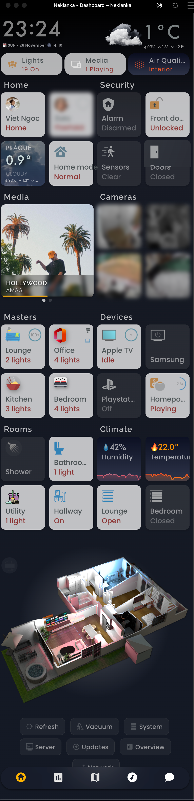
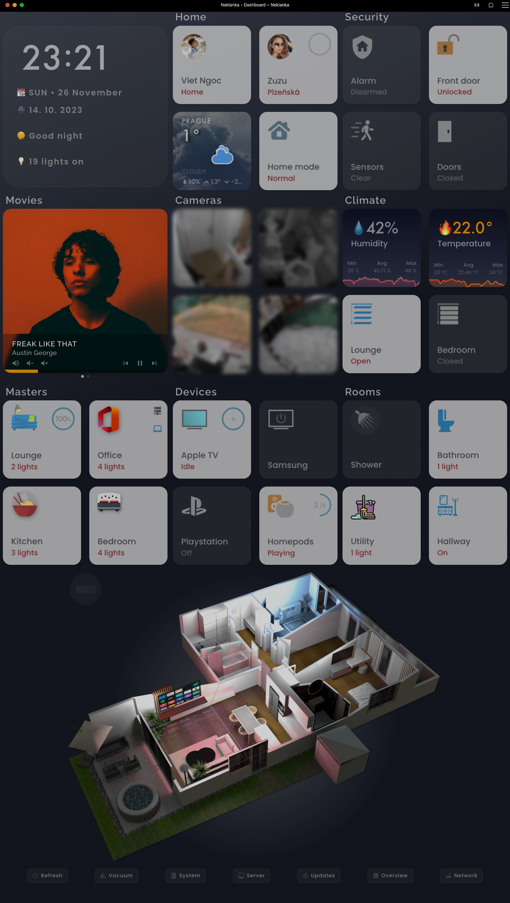
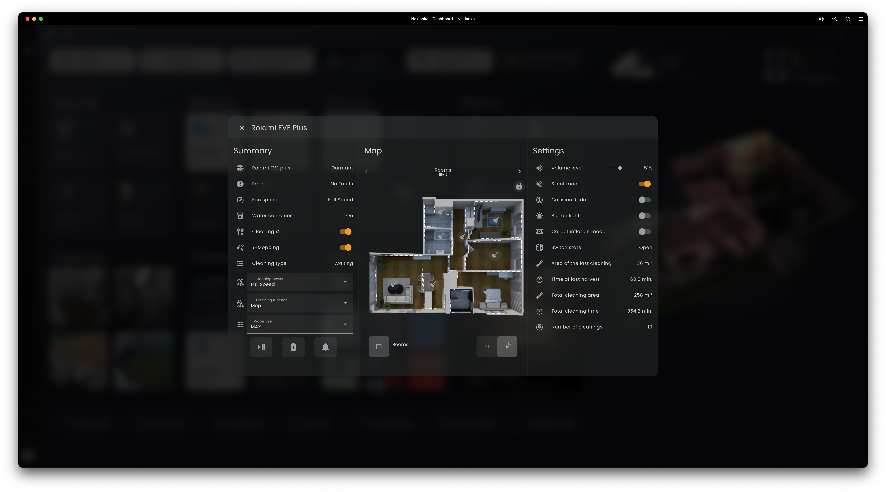
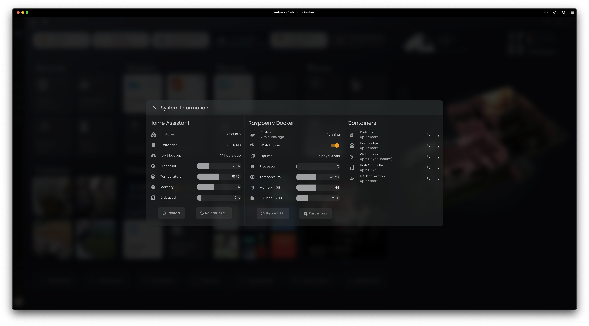
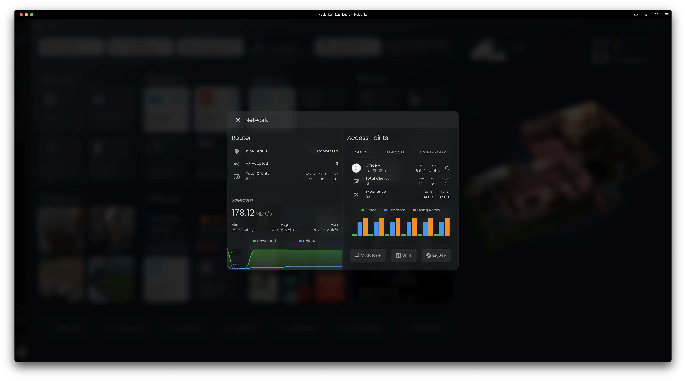
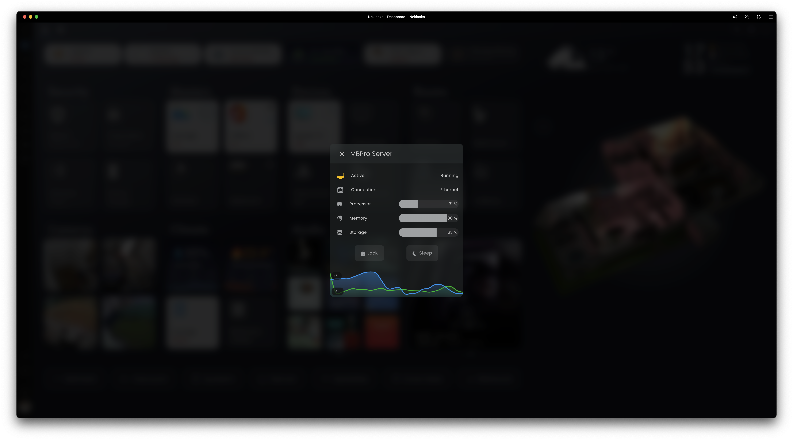

# Hey there!

Welcome to my little corner of the tech world! 🚀

This is where I store all the cool configurations for my Home Assistant system. Well, it's a mix of awesome codes and setups I discovered from the Home Assistant community. Seriously, those folks are wizards! 🧙‍♂️ As a bit of an internet newbie turned tech enthusiast, I stumbled upon the magic of IT, and this repository is my way of sharing the joy and knowledge I've gained along the way. Dive in, explore, and let the tech magic begin! ✨

I frequently refresh my configuration files. My current Home Assistant version is 2023.11.3. If you find something you like, don't forget to give my repository a ⭐️!

https://github.com/ngocjohn/hass-config/assets/96962827/48cc5542-0ca7-480b-9c95-77aa9464eb10

## Some statistics about my installation:

| Lines of code | Automations | Binary sensors | Device trackers | Lights | Media players | Sensors | Switches | Scripts |
| :--: | :--: | :--: | :--: | :--: | :--: | :--: | :--: | :--: |
| 32,780 | 30 | 186 | 51 | 52 | 33 | 857 | 187 | 37 |

## My installed extensions:

  
Add-ons

### Add-ons
- Advanced SSH & Web Terminal
- AppDaemon
- ArgonOne Active Linear Cooling
- Cloudflared
- eufy-security-ws
- Glances
- Home Assistant Google Drive Backup
- Log Viewer
- Mosquitto broker
- Music Assistant BETA
- Node-RED
- PS5 MQTT
- RTSP Simple Server Add-on
- Samba share
- SQLite Web
- Studio Code Server
- Zigbee2MQTT

  
Custom integrations

### Custom integrations
- [Adaptive Lighting](https://github.com/basnijholt/adaptive-lighting)
- [Better Thermostat](https://github.com/KartoffelToby/better_thermostat)
- [Browser Mod](https://github.com/thomasloven/hass-browser_mod)
- [Dyson](https://github.com/libdyson-wg/ha-dyson)
- [Eufy Security](https://github.com/fuatakgun/eufy_security)
- [Extended Openai Conversation](https://github.com/jekalmin/extended_openai_conversation)
- [Fontawesome](https://github.com/thomasloven/hass-fontawesome)
- [Generate Readme](https://github.com/custom-components/readme)
- [Google Cloud Speech To Text](https://github.com/chatziko/ha-google-cloud-stt)
- [Googlegeocode Hass](https://github.com/gregoryduckworth/GoogleGeocode-HASS)
- [Govee](https://github.com/LaggAt/hacs-govee)
- [HACS](https://github.com/hacs/integration)
- [Kodi Media Sensors](https://github.com/jtbgroup/kodi-media-sensors)
- [Media Player Template](https://github.com/Sennevds/media_player.template)
- [Mercedesme 2020](https://github.com/ReneNulschDE/mbapi2020)
- [Music Assistant](https://github.com/music-assistant/hass-music-assistant)
- [Node Red Companion](https://github.com/zachowj/hass-node-red)
- [Nuki Lock](https://github.com/kvj/hass_nuki_ng)
- [Powercalc](https://github.com/bramstroker/homeassistant-powercalc)
- [Simpleicons](https://github.com/vigonotion/hass-simpleicons)
- [Spook 👻 Not Your Homie](https://github.com/frenck/spook)
- [Spotcast](https://github.com/fondberg/spotcast)
- [Trakt](https://github.com/dylandoamaral/trakt-integration)
- [Unifi Status](https://github.com/zvldz/unifi_status)
- [Xiaomi Cloud Map Extractor](https://github.com/PiotrMachowski/Home-Assistant-custom-components-Xiaomi-Cloud-Map-Extractor)
- [Xiaomi Miot Auto](https://github.com/al-one/hass-xiaomi-miot)
- [Ytube Music Player](https://github.com/KoljaWindeler/ytube_music_player)

  
Lovelace plugins

### Lovelace plugins
- [Apexcharts Card](https://github.com/RomRider/apexcharts-card)
- [Apple Tv Remote Control](https://github.com/madmicio/Apple-Tv-Card)
- [Atomic Calendar Revive](https://github.com/totaldebug/atomic-calendar-revive)
- [Auto Entities](https://github.com/thomasloven/lovelace-auto-entities)
- [Bar Card](https://github.com/custom-cards/bar-card)
- [Battery State Card / Entity Row](https://github.com/maxwroc/battery-state-card)
- [Better Thermostat Ui](https://github.com/KartoffelToby/better-thermostat-ui-card)
- [Bubble Card](https://github.com/Clooos/Bubble-Card)
- [Button Card](https://github.com/custom-cards/button-card)
- [Card Mod](https://github.com/thomasloven/lovelace-card-mod)
- [Clock Weather Card](https://github.com/pkissling/clock-weather-card)
- [Config Template Card](https://github.com/iantrich/config-template-card)
- [Custom Brand Icons](https://github.com/elax46/custom-brand-icons)
- [Custom Icons](https://github.com/Mariusthvdb/custom-icons)
- [Decluttering Card](https://github.com/custom-cards/decluttering-card)
- [Fold Entity Row](https://github.com/thomasloven/lovelace-fold-entity-row)
- [Ha Floorplan](https://github.com/ExperienceLovelace/ha-floorplan)
- [History Explorer Card](https://github.com/alexarch21/history-explorer-card)
- [Home Assistant Swipe Navigation](https://github.com/zanna-37/hass-swipe-navigation)
- [Honeycomb Menu](https://github.com/Sian-Lee-SA/honeycomb-menu)
- [Horizon Card](https://github.com/rejuvenate/lovelace-horizon-card)
- [Hourly Weather Card](https://github.com/decompil3d/lovelace-hourly-weather)
- [Hui Element](https://github.com/thomasloven/lovelace-hui-element)
- [Kiosk Mode](https://github.com/NemesisRE/kiosk-mode)
- [Kodi Playlist Card](https://github.com/jtbgroup/kodi-playlist-card)
- [Layout Card](https://github.com/thomasloven/lovelace-layout-card)
- [Local Conditional Card](https://github.com/PiotrMachowski/Home-Assistant-Lovelace-Local-Conditional-card)
- [Logbook Card](https://github.com/royto/logbook-card)
- [Mini Graph Card](https://github.com/kalkih/mini-graph-card)
- [Mini Media Player](https://github.com/kalkih/mini-media-player)
- [Multiple Entity Row](https://github.com/benct/lovelace-multiple-entity-row)
- [Mushroom](https://github.com/piitaya/lovelace-mushroom)
- [My Cards Bundle](https://github.com/AnthonMS/my-cards)
- [Paper Buttons Row](https://github.com/jcwillox/lovelace-paper-buttons-row)
- [Platinum Weather Card](https://github.com/Makin-Things/platinum-weather-card)
- [Purifier Card](https://github.com/denysdovhan/purifier-card)
- [Restriction Card](https://github.com/iantrich/restriction-card)
- [Roku Card](https://github.com/iantrich/roku-card)
- [Rpi Monitor Card](https://github.com/ironsheep/lovelace-rpi-monitor-card)
- [Search Card](https://github.com/postlund/search-card)
- [Shutter Card](https://github.com/Deejayfool/hass-shutter-card)
- [Simple Thermostat](https://github.com/nervetattoo/simple-thermostat)
- [Simple Weather Card](https://github.com/kalkih/simple-weather-card)
- [Slider Button Card](https://github.com/custom-cards/slider-button-card)
- [Spotify Lovelace Card](https://github.com/custom-cards/spotify-card)
- [Stack In Card](https://github.com/custom-cards/stack-in-card)
- [State Switch](https://github.com/thomasloven/lovelace-state-switch)
- [Swipe Card](https://github.com/bramkragten/swipe-card)
- [Tabbed Card](https://github.com/kinghat/tabbed-card)
- [Timer Bar Card](https://github.com/rianadon/timer-bar-card)
- [Tv Remote Card (With Touchpad And Haptic Feedback)](https://github.com/usernein/tv-card)
- [Upcoming Media Card](https://github.com/xZetsubou/upcoming-media-card)
- [Uptime Card](https://github.com/dylandoamaral/uptime-card)
- [Vacuum Card](https://github.com/denysdovhan/vacuum-card)
- [Vertical Stack In Card](https://github.com/ofekashery/vertical-stack-in-card)
- [Weather Card](https://github.com/bramkragten/weather-card)
- [Weather Chart Card](https://github.com/mlamberts78/weather-chart-card)
- [Weather Radar Card](https://github.com/Makin-Things/weather-radar-card)
- [Xiaomi Vacuum Map Card](https://github.com/PiotrMachowski/lovelace-xiaomi-vacuum-map-card)

***

Generated by the [custom readme integration](https://github.com/custom-components/readme)

## My dashboard:

My dashboard is basically a cool fusion of ideas, mainly inspired by the awesome [Matt8707](https://github.com/matt8707/hass-config) 🌟. I threw in some extra goodies to make it perfect for my needs! 🚀

The floorplan is crafted using the [Ha Floorplan](https://github.com/ExperienceLovelace/ha-floorplan) Lovelace plugin, and it features interactive controls thanks to the [Honeycomb Menu](https://github.com/Sian-Lee-SA/honeycomb-menu).

https://github.com/ngocjohn/hass-config/assets/96962827/9e4efab5-5bc5-4b71-94d2-37937cf1df77

### Mobile and tablet:

<table>
  <tr>
    <td></td>
    <td></td>
  </tr>
</table>

### Popups:
<table>
  <tr>
    <td>
    <td>
  </tr>
  <tr>
    <td>
    <td>
  </tr>
</table>